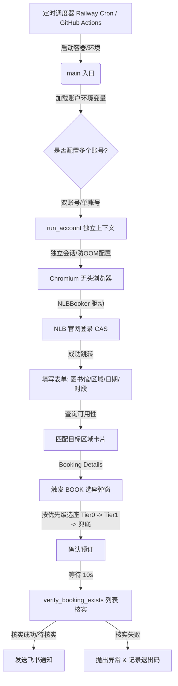

# Project Analysis: NLB Seat Auto-Booking

This document provides a comprehensive technical analysis of the NLB Seat Auto-Booking repository. It is generated based on direct inspection of the codebase.

---

## 1. 项目定位 (Project Positioning)

*   **解决问题**：新加坡国家图书馆（NLB）的自习室座位预约竞争非常激烈。预约通常在每天中午 12:00 SGT 准时开放，热门座位几秒内就会被抢光。本项目通过自动化脚本，实现每天 12:00 SGT 定时登录、极速填表、按优先级选座并校验预约状态，解决人工抢座耗时且成功率低的问题。
*   **目标用户**：频繁使用新加坡国家图书馆自习室（如 Punggol Library Study Zone Level 3 等）且需要长期预订座位的读者。
*   **系统类型**：基于 Playwright 的无头浏览器自动化（Bot / Web Scraper）和定时调度任务。
*   **核心价值**：高可用性抢座、双账号并行支持、座次优先级判定、飞书推送通知、全自动异常重试，以及防“假成功”的双重列表核实机制。

---

## 2. 系统架构 (System Architecture)

该项目结构紧凑、职责清晰，整体采用**声明式调度 + 幂等运行**的架构设计。



### 核心模块划分
1.  **调度层**：由 GitHub Actions（`.github/workflows/book_seat.yml` 和 `book_seat.yml`）或 Railway Scheduled Job 外部触发。程序本身不驻留后台，单次触发后执行完毕即自动退出。
2.  **配置加载与入口层 (`main`)**：解析环境变量（支持双账号双会话），以最优启动参数拉起无头 Chromium 浏览器。
3.  **流程控制层 (`run_account`)**：管理单个账号 of 独立浏览器上下文（Context），定义预约成功/失败的逻辑流，并在结束后构建并发送飞书通知卡片。
4.  **自动化驱动层 (`NLBBooker`)**：核心逻辑类。封装了对 NLB 网站的所有页面操作，包括：
    *   `login()`: myLibrary 凭证登录。
    *   `select_library()`, `select_area()`, `select_date()`, `select_time()`, `select_duration()`: 针对 Vuetify 组件特性的防闪烁、可滚动下拉框操作。
    *   `_click_area_and_book()`: 卡片跳转和点 Booking 前的数据核对。
    *   `_handle_selection_dialog()`: 处理 Selection 选座，触发选项单选框。
    *   `_dismiss_banner()`: **关键修复点**。检测并关闭 My Bookings 等页面顶部弹出的红色提醒横幅，避免由于元素遮挡导致无法切换标签页而触发“假失败”核验。
    *   `verify_booking_exists()`: **终极校验点**。通过切换到 Upcoming 标签页，以疑罪从无、双重核实匹配（日期 + 时间段）的方式对预约进行最终判定。

### 通信方式
*   **HTTPS (Web Automation)**: Playwright 驱动 Chromium 浏览器，通过 HTTPS 与 NLB 预约平台交互。
*   **HTTPS POST**: 使用 Python 原生 `urllib.request` 库向飞书群机器人 Webhook 地址发送 JSON 载荷，推送互动卡片。

---

## 3. 技术栈 (Technology Stack)

| 类别 | 技术/库 | 说明 |
| :--- | :--- | :--- |
| **编程语言** | Python 3.12 | 统一使用异步协程 (`asyncio`) 实现高并发操作。 |
| **自动化测试/爬虫框架** | Playwright >= 1.45 | 唯一的第三方运行时依赖，负责模拟用户操作。使用 `playwright.async_api`。 |
| **时区数据库** | tzdata >= 2024.1 | 保证在精简 Linux 容器（如 python:slim）中 `ZoneInfo("Asia/Singapore")` 正常解析。 |
| **构建与容器化** | Docker | 使用 `python:3.12-slim` 构建运行镜像，并在其中集成 Chromium 及其依赖。 |
| **部署与运行平台** | Railway / GitHub Actions | Railway 作为定时服务运行任务；GitHub Actions 负责自动化流水线和兜底运行。 |
| **通知系统** | 飞书群机器人 (Feishu Webhook) | 发送含有颜色主题（成功为绿色，失败为红色）的 Markdown 互动卡片。 |
| **数据库/ORM** | 无 | **[本项目不包含任何数据库，也无相关表结构和 Migration]** |
| **AI 模型/中间件** | 无 | 项目无 AI 模块或中间件依赖。 |

---

## 4. 数据与业务流 (Data & Business Flow)

### 4.1 数据流转关系
本项目的核心数据主要为**预约凭证、配置参数以及预订状态**：
1.  **输入**：从系统环境变量加载 `NLB_USERNAME`、`NLB_PASSWORD`、`FEISHU_WEBHOOK_URL` 等。
2.  **流转**：通过 `NLBBooker` 实例，将这些凭证用于 CAS 认证，配置参数（如 `TARGET_LIBRARY`、`TARGET_AREA`、`TIME_SLOTS` 等）用于表单填写。
3.  **验证**：通过读取 Upcoming 列表，捕获包含目标日期的静态 DOM 文本，生成最终预订成功的座位 ID。
4.  **输出**：格式化状态，组装为 Markdown payload，调用 Feishu Webhook 接口推送给用户。

### 4.2 核心业务运行步骤 (Step-by-step)
以 `book_seat.py` (v15) 为基准，单时段的完整业务流程如下：

```
[开始运行]
   │
   ▼
1. 启动 Playwright ── 开启无痕 Chromium 并配置 UA、分辨率及 SGT 时区
   │
   ▼
2. 登录 CAS ── 导航至 Account tab -> 检测到 CAS 登录 -> 填入账密 -> 提交并检测 URL 跳转
   │
   ▼
3. 打开 New Booking ── 点击导航栏 "New" 选项卡 -> 等待 Vuetify 容器加载
   │
   ▼
4. 填写表单：
   ├─ 选图书馆: 点击 Dropdown -> 循环滚动页面 -> 精确匹配 "Punggol Library" -> 等待弹窗关闭
   ├─ 选区域: 点击 Area -> 选中 "Study Zone, Level 3" 单选框
   ├─ 选日期: 弹出日历 -> 自动翻月 -> 匹配并点击目标日期 (通常为明天)
   ├─ 选时间: 点击 Time -> 精确匹配整词（如 "^11:00 am$" 防止匹配 12:00 pm 造成下午订成中午）
   └─ 选时长: 点击 Duration -> 匹配备选参数（如 "1:00" / "1 hour"）-> 匹配失败时选择首项兜底
   │
   ▼
5. 字段预校验 ── 读取输入框 textContent 确认与期望一致，若不一致进行警告
   │
   ▼
6. 检查空位 ── 点击 "CHECK AVAILABLE SLOTS" 按钮 -> 等待结果卡片渲染
   │
   ▼
7. 进入预订详情 ── 寻找目标 Area 卡片 -> 点击卡片 -> 进入 Booking Details 页
   │
   ▼
8. 详情二次校验 ── 检测 Details 页面中是否包含目标日期与起始时间（防止表单提交时发生字段偏差失效）
   │
   ▼
9. 触发 Selection ── 点击 "BOOK" 按钮 -> 弹出 "Selection" 窗口
   │
   ▼
10. 选择具体座位 ── 点击 "Select seat" -> 弹出 Seat 候选框 -> 遍历滚动收集全部可用座位
    ├─ 依次匹配 Tier 0 (最优先级座号，如 S74、S86)
    ├─ 依次匹配 Tier 1 (其余指定座号，如 S1-S17)
    └─ 若全无，选择 "Any available seat" 进行兜底
   │
   ▼
11. 提交订单 ── 确认 CONFIRM 按钮脱离 disabled 禁用态 -> 点击 CONFIRM -> 依次点击弹窗的 "Confirm/OK"
   │
   ▼
12. 终极验证 (10s 后) ── 进入 "Booking" 导航 -> 关闭可能的红色提醒 banner -> 点击 "Upcoming" 标签
    ├─ 检测该页面是否同时存在目标【日期】和【时段】
    ├─ 若未成功切换到 Upcoming，返回 None（疑罪从无，视为待核实成功）
    ├─ 若成功切换但在列表中未匹配到，则判定为假成功 (返回 False)
   │
   ▼
13. 推送结果 ── 将本账号的所有 Slot 预订状况汇总，并通过飞书机器人推送到群组
```

---

## 5. 部署与运维 (Deployment & Operations)

### 5.1 本地开发与调试
1.  **直接运行**：安装 Python 3.12 依赖并安装 Playwright Chromium，通过 `export` 或 `.env` 文件加载环境变量，执行 `python book_seat.py`。
2.  **Docker 调试**：
    *   构建镜像：`docker build -t nlb-booking .`
    *   运行容器：`docker run --rm -e NLB_USERNAME="xxx" -e NLB_PASSWORD="xxx" nlb-booking`

### 5.2 Railway 云平台部署 (Scheduled Job 模型)
通过 `railway.json` 和 `Dockerfile` 进行声明式部署：
*   **构建机制**：`railway.json` 声明 `builder: DOCKERFILE`，Railway 自动读取项目根目录的 `Dockerfile` 构建镜像。
*   **构建优化**：在 `Dockerfile` 中执行 `playwright install --with-deps chromium`，保证运行时容器具备完备 of Chromium 运行库及字体。
*   **运行时区**：`Dockerfile` 强制设定 `TZ=Asia/Singapore`，并将 `/usr/share/zoneinfo/Asia/Singapore` 软链接至本地，使得容器系统时钟与新加坡时钟精确同步。
*   **重启策略**：声明 `"restartPolicyType": "NEVER"`。因为是 Scheduled Job，脚本跑完执行 `exit 0` / `exit 1` 退出后，容器不应被 Railway 守护进程反复拉起。
*   **配置步骤**：
    1.  连接 GitHub 仓库至 Railway，部署分支指定为 `nlbrailway`。
    2.  在 Service Variables 中配置必要的环境变量。
    3.  在 Settings 中开启 **Cron Schedule**，填入 `0 4 * * *`（由于 Railway 使用 UTC，04:00 UTC = 12:00 SGT）。

### 5.3 GitHub Actions 自动工作流
项目包含两个 GitHub Actions 定时触发流：

1.  **精确卡点版 (`book_seat.yml`)**：
    *   **触发时机**：新加坡时间 11:35（UTC 03:35）。
    *   **卡点机制**：由于 GitHub Actions 启动有 2~15 分钟的排队延迟，通过提前在 11:35 触发启动，下载环境（耗时约 3 分钟），并在脚本执行前通过 Shell 脚本计算距离 UTC 04:00 (SGT 12:00:00) 的秒数，使用 `sleep` 精确等待，并在 12:00:00 准点准秒发起网络请求，这极大地提高了极速抢占高优座位的成功率。
2.  **直接运行版 (`.github/workflows/book_seat.yml`)**：
    *   **触发时机**：新加坡时间 12:00（UTC 04:00）。触发即开始跑，不进行 Shell 精确卡点等待。常作为测试或无需高精度卡点时使用。

---

## 6. API 与 数据库 (API & Database Details)

### 6.1 外部依赖 API 接口

#### 1. NLB 座位预约系统（抓取对象）
*   **主页 URL**：`https://www.nlb.gov.sg/seatbooking` (HTTPS)
*   **CAS 登录页**：`https://signin.nlb.gov.sg/...` (HTTPS)
*   **主要动作**：
    *   点击 `Account` Tab
    *   输入 `username` 与 `password` 登录
    *   在新建预约页选择图书馆、自习室、时段、时长
    *   查询可用插槽，并在详情页点击 `BOOK`
    *   在 Selection 弹窗选择指定 Seat ID 并 `CONFIRM`
    *   在 Booking 历史中查询 Upcoming 列表核实

#### 2. 飞书 Webhook 自定义机器人 API
*   **接口 URL**：由变量 `FEISHU_WEBHOOK_URL` 动态设定。
*   **请求方法**：`POST`
*   **Content-Type**：`application/json`
*   **参数格式 (Interactive Card)**：
    ```json
    {
      "msg_type": "interactive",
      "card": {
        "header": {
          "title": {"tag": "plain_text", "content": "🪑 NLB 图书馆座位预约成功！（账号1）"},
          "template": "green"
        },
        "elements": [
          {
            "tag": "div",
            "text": {
              "tag": "lark_md",
              "content": "**👤 账号**：abc***12\n**📅 预约日期**：2026-07-10\n**📍 图书馆**：Punggol Library (Study Zone, Level 3)\n- **11:00–12:00**：✅ 成功(已核实)  座位: S74"
            }
          }
        ]
      }
    }
    ```

### 6.2 数据库与数据持久化
*   **数据库状态**：**[本项目不包含任何数据库，也无相关表结构和 Migration]**
*   **调试媒介**：运行时的出错截图会保存在容器内的 `screenshots/` 目录中。在 GitHub Actions 流水线里，出错或无论如何，均会通过 `actions/upload-artifact@v4` 将截图打包并上传，保留天数为 7 天，供后续开发者在线排查。

---

## 7. 定时任务 (Cron Jobs)

本项目支持两种环境下的定时任务：

### 7.1 Railway 定时任务
*   **Cron 表达式**：`0 4 * * *`
*   **时区说明**：UTC 时区。对应新加坡时间（SGT）每天 **12:00 PM**。
*   **运行逻辑**：到点触发启动容器实例，顺序执行 `python book_seat.py`。任务正常完成（或由于异常硬退退出）后，容器销毁。

### 7.2 GitHub Actions 触发任务
*   **定时任务 1 (`book_seat.yml`)**：
    *   `cron: "35 3 * * *"` (即 UTC 03:35，SGT 11:35)
    *   **逻辑**：提前拉起 Runner，在步骤中计算差值，`sleep` 等待到 SGT 12:00 启动 Python 脚本。
*   **定时任务 2 (`.github/workflows/book_seat.yml`)**：
    *   `cron: "0 4 * * *"` (即 UTC 04:00，SGT 12:00)
    *   **逻辑**：不进行 Shell 卡点等待，Runner 启动后立即跑脚本。

---

## 8. 项目结构 (Project Structure)

```
/Users/tyrone/Desktop/code/nlb
├── .dockerignore                # Docker 镜像打包过滤规则
├── .gitignore                   # Git 版本库忽略规则
├── Dockerfile                   # Railway/本地容器运行定义 (集成 Python 环境与 Chromium)
├── README.md                    # 项目用户手册与快速开始说明
├── book_seat.py                 # 当前生产环境运行的核心脚本 (v15 版本)
├── book_seat.yml                # 供 GitHub Actions 使用的精确卡点定时工作流 (SGT 11:35 启动)
├── book_seat_v9.py              # 旧版抢座脚本 (v9 版本，使用座位图选座逻辑，供对比或归档)
├── railway.json                 # Railway 服务部署配置文件 (定义 Dockerfile 构建与重启规则)
├── requirements.txt             # 项目依赖声明文件 (Playwright 与 tzdata)
└── .github                      
    └── workflows                
        └── book_seat.yml        # 供 GitHub Actions 使用的即时运行定时工作流 (SGT 12:00 启动)
```

### 核心文件职责解析
*   `book_seat.py`：最新版本的机器人程序。修复了 NLB 改版后界面遮挡问题。引入 `_dismiss_banner` 关闭弹窗横幅，将抢座动作放在 “Booking Details -> Selection Modal -> Click Input to show seat options” 这一真实手机客户端的逻辑。
*   `book_seat_v9.py`：此脚本为旧版遗留。旧版流程中含有座位分布图扫描（Prefered Seat 弹窗），通过解析座位图坐标选择位置。可作架构对比参考。
*   `Dockerfile`：不仅包含了 Playwright 的核心包，还强制加入了时区软链接以及 Chromium 各种 Linux 动态库依赖下载，避免运行过程中因 Chromium 的 Sandbox 或共享内存不足而导致容器崩溃。

---

## 9. 配置与依赖 (Configuration & Env Variables)

本项目通过环境变量加载动态配置：

| 变量名 | 必填性 | 说明 | 示例 |
| :--- | :--- | :--- | :--- |
| `NLB_USERNAME` | **✅ 必填** | 账号 1 的登录凭证（NRIC / Email / myLibrary ID）。 | `S9912345A` |
| `NLB_PASSWORD` | **✅ 必填** | 账号 1 的 NLB 账户密码。 | `Password123` |
| `NLB_USERNAME_2` | 可选 | 账号 2 的登录凭证。若配对配置，脚本将依次预订两个账号。 | `S9954321B` |
| `NLB_PASSWORD_2` | 可选 | 账号 2 的密码（需与 `NLB_USERNAME_2` 成对）。 | `MySecurePass` |
| `FEISHU_WEBHOOK_URL`| 可选 | 飞书群自定义机器人的 Webhook。为空则跳过飞书通知。 | `https://open.feishu.cn/open-apis/bot/v2/hook/...` |
| `BOOKING_DATE_OFFSET`| 可选 | 预约哪天的座位（0=今天，1=明天，以此类推。默认 `1`）。 | `1` |
| `TZ` | 系统级 | 时区控制。已在 `Dockerfile` 和工作流内固定为 `Asia/Singapore` | `Asia/Singapore` |

### 外部服务依赖
*   **CAS Single Sign-On (NLB 官方提供)**：用于账户验证。若 NLB 更改登录页滑块验证码或启用 2FA，此脚本需要人工介入或更新 Playwright 绕过逻辑。
*   **Feishu Bot Open API**：用于将状态和座位号输出给团队或个人。
