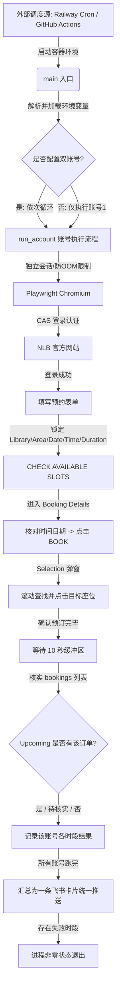

# 🪑 NLB Seat Auto-Booking (新加坡国家图书馆座位自动预约机器人)

[](https://railway.app)
[](https://github.com/features/actions)

本项目是一个专门用于自动预约**新加坡国家图书馆 (NLB)** 自习室座位的自动化机器人。通过 Playwright 无头浏览器模拟移动端用户操作，实现自动登录、极速填表、智能座位筛选、订单列表终极确认及飞书消息通知。

现已深度支持 **Railway 一键部署**（以 Scheduled Job 形式运行）及 **GitHub Actions 定时卡点运行**。

---

## 🚀 核心价值与功能

*   **⚡ 极速自动抢座**：每天中午 12:00 SGT（预约开放瞬间）自动登录并提交预约，解决人工操作慢、名额秒空的问题。
*   **👥 双账号错峰支持**：支持配置最多两个独立的 NLB 账号，在单次运行中依次独立登录、选座、验证。账号 1 预约 `11:00–12:00 / 13:00–14:00 / 15:00–16:00 / 17:00–18:00`；账号 2（若配置）在账号 1 结束后开始，时段整体提前一小时（`10:00–11:00 / 12:00–13:00 / 14:00–15:00 / 16:00–17:00`）。
*   **🎯 智能座位优先级 (Tiers)**：
    *   **Tier 0**：最优先尝试的特定座位（如 `S74`, `S86`, `S1`, `S17`）。
    *   **Tier 1**：次优先区域的座位序列（如 `S74–S86`, `S1–S17` 范围内的其余座位）。
    *   **Tier 2**：兜底选择（在上述座位皆不可用时，自动选取下拉列表中首个 "Any available seat" 进行保底预约）。
*   **🔒 防“假成功”双重验证**：除了拦截预约结果页面的文案，脚本在完成后会等待 10 秒，并进入 `My Bookings` -> `Upcoming` 列表核实该预约真实存在，防止因静态旧缓存导致的误报。
*   **🛟 防“假报错”降级判定**：列表核实不到不再直接判失败——仅当预约结果页当时明确提示过错误才判真失败；否则自动重试核实一次，仍找不到就降级为“⚠️ 成功(待核实)”，避免“预订成功却误报失败”导致的非零退出与红色告警。
*   **📱 飞书互动卡片推送**：所有账号预订全部结束后，将各账号结果汇总为**一条** Markdown 通知卡片统一推送（全部成功为绿色，存在失败/异常为红色）。
*   **🛡️ 容错性与健壮性**：
    *   自动处理及关闭 My Bookings 列表顶部盖住标签栏的红色签到提醒横幅（`check-in before 14 minutes`），防止元素遮挡导致核实流程失败。
    *   支持单时段自动重试，某一时段失败会自动回退主页重新进入流程。

---

## 📐 系统架构与业务流程

### 1. 技术架构图
本机器人采用**无状态容器化运行 + 声明式外部定时调度**的架构设计。



### 2. 核心业务流 (Step-by-step)

1.  **环境载入**：读取环境变量中的用户名、密码及飞书 Webhook 地址，拉起优化过的 Chromium 实例（关闭 GPU、共享内存等，防止容器 OOM）。
2.  **账号隔离**：使用独立的 `new_context` 创建隔离的浏览器会话，模拟 iPhone 端的 Safari 浏览器环境，时区锁定为新加坡时间 (SGT)。
3.  **CAS 模拟登录**：点击 `Account` 导航卡片，进入统一认证登录界面输入凭证，等待跳转回主站。
4.  **表单自动填写**：
    *   **Library & Area**：定位对应的输入框，打开弹窗滚动找到匹配项目（如 Punggol Library）。
    *   **Date**：打开日历组件，翻页至对应月份并点击目标日期（通常为明天，根据 `BOOKING_DATE_OFFSET` 决定）。
    *   **Time & Duration**：选取预约时段与预约时长。时间匹配支持 `^...$` 正则精确匹配，防止下午时段错订成中午。
5.  **高优先选座 (UI Selection Dialog)**：
    *   在 Search 页面定位到目标区域卡片，点击 `BOOK`。
    *   在 Booking Details 页面核对时间日期无误后，再次点击 `BOOK`。
    *   在弹出的 `Selection` 对话框中点击 `Select seat`，并在弹出的列表里按 **Tier 0 -> Tier 1 -> 任意空位** 滚动寻找并点选对应座位。
    *   点击已被启用的 `CONFIRM` 按钮提交。
6.  **列表核实与推送**：
    *   延时等待 10s 后跳转至 `Booking` Tab。
    *   清除可能遮挡选项卡的红色提醒横幅，切换至 `Upcoming` 列表，读取文本内容进行二次核查。
    *   通过飞书自定义机器人接口，发送最终汇总结果。

---

## 📂 项目结构

```
.
├── .dockerignore                # Docker 构建忽略文件
├── .gitignore                   # Git 版本控制忽略文件
├── Dockerfile                   # Docker 镜像构建脚本 (集成 Node.js/Chromium 依赖)
├── PROJECT_ANALYSIS.md          # 详细的项目架构与源码分析报告 (开发者必读)
├── README.md                    # 本用户手册
├── book_seat.py                 # 核心运行脚本 (当前正在使用的 v15 版本)
├── book_seat_v9.py              # 历史遗留版本脚本 (使用旧版座位图选座逻辑，仅供参考)
├── railway.json                 # Railway 部署及服务运行定义
├── requirements.txt             # Python 依赖声明
└── .github
    └── workflows
        └── book_seat.yml        # GitHub Actions 定时任务工作流 (12:00 SGT 触发)
```

---

## 🛠️ 技术栈分类

*   **运行语言**：Python 3.12 (异步协程 `asyncio`)
*   **自动化依赖**：Playwright >= 1.45 (集成 Chromium)
*   **时区支持**：tzdata >= 2024.1
*   **容器技术**：Docker (基于 `python:3.12-slim` 精简镜像)
*   **托管部署**：Railway (Scheduled Job)、GitHub Actions
*   **消息网关**：飞书 Webhook 自定义群机器人 API
*   **数据库**：**无**（[本项目属于纯脚本工具，不使用任何数据库，无建表及 Migration 逻辑]）

---

## 🚀 快速开始

### 1. 本地安装与开发调试

请确保您的本地开发环境已安装 Python 3.12+。

```bash
# 1. 克隆本项目并进入目录
git clone <repository_url>
cd nlb

# 2. 安装 Python 核心依赖
pip install -r requirements.txt

# 3. 安装 Playwright Chromium 浏览器及其驱动
playwright install chromium

# 4. 配置本地临时环境变量（Linux/macOS）
export NLB_USERNAME="你的myLibraryID"
export NLB_PASSWORD="你的NLB密码"
export FEISHU_WEBHOOK_URL="https://open.feishu.cn/open-apis/bot/v2/hook/xxxx" # 可选
export BOOKING_DATE_OFFSET=1                                                 # 可选，1代表预约明天，默认1

# 5. 运行脚本
python book_seat.py
```

在本地调试时，运行截图将保存在项目目录下的 `screenshots/account1/` 等目录中，可用于排查界面元素定位问题。

---

## 🚂 部署指南

### 1. Railway 云平台一键部署 (推荐)

本项目已针对 Railway 进行适配，采用 **Scheduled Job (定时任务)** 模型，程序执行完后自动退出销毁，不占用持续收费的常驻内存。

1.  登录 [Railway](https://railway.app/)，点击 **New Project** 并关联您的 GitHub 本仓库。
2.  在项目的 **Service -> Settings -> Source** 中，确保将部署分支设置为 **`nlbrailway`**。
3.  在 **Variables** 面板中，添加以下环境变量：

    | 变量名 | 是否必填 | 说明 |
    | :--- | :---: | :--- |
    | `NLB_USERNAME` | **✅ 必填** | 账号 1 的 NRIC / Email / myLibrary ID |
    | `NLB_PASSWORD` | **✅ 必填** | 账号 1 的密码 |
    | `NLB_USERNAME_2` | 可选 | 账号 2 的用户名（配置后会启用双账号依次预约） |
    | `NLB_PASSWORD_2` | 可选 | 账号 2 的密码（必须与 `NLB_USERNAME_2` 成对配置） |
    | `FEISHU_WEBHOOK_URL` | 可选 | 飞书自定义机器人 Webhook URL，不填则跳过推送 |
    | `BOOKING_DATE_OFFSET` | 可选 | 预约偏移天数：`0`=今天，`1`=明天（默认 `1`） |

    > *注：系统内部时区已在 Dockerfile 中通过 `TZ=Asia/Singapore` 锁死，无需在 Railway 页面中手动配置时区。*

4.  配置定时执行（每天 12:00 SGT）：
    进入 **Settings -> Cron Schedule**，填入以下 Cron 表达式：
    ```text
    0 4 * * *
    ```
    *(注：Railway 的 Cron 必须使用 **UTC** 时区。SGT 12:00 对应 UTC 04:00)*
5.  在 **Deployments** 页面点击 **Deploy/Redeploy** 手动触发一次，即可立即执行并校验配置和飞书推送是否正确。

---

### 2. GitHub Actions 定时部署

如果您不希望使用云服务器托管，可以直接利用 GitHub 提供的免费 Runner 运行。

1.  将本项目推送至您的私有或公开 GitHub 仓库。
2.  在 GitHub 仓库的 **Settings -> Secrets and variables -> Actions** 中，添加以下 **Repository secrets**：
    *   `NLB_USERNAME`
    *   `NLB_PASSWORD`
    *   `FEISHU_WEBHOOK_URL` (可选)
3.  定时触发说明：
    *   默认的工作流文件位于 `.github/workflows/book_seat.yml`，设定在每日 UTC 04:00 (SGT 12:00) 自动触发。
    *   您可以随时在 GitHub 仓库的 **Actions** 菜单中，选择 `NLB Seat Auto-Booking` 手动点击 **Run workflow** 触发测试。

---

## ⚙️ 定时任务说明

本项目的核心定时任务设定如下：

| 定时源 | Cron 表达式 | 触发时间 (SGT) | 作用与特点 |
| :--- | :--- | :--- | :--- |
| **Railway 定时** | `0 4 * * *` | 12:00 SGT | 由平台在后台拉起 Docker 容器，启动即运行，运行完毕即退出。 |
| **GitHub Actions 定时** | `0 4 * * *` | 12:00 SGT | 利用 GitHub 免费环境定时触发，免运维，但可能存在 Actions 排队延迟。 |

---

## 🔧 开发与配置修改指南

由于本项目无数据库设计，所有的业务配置均为**代码层声明**。如果需要修改预约图书馆、区域或时段，请打开 [book_seat.py](file:///Users/tyrone/Desktop/code/nlb/book_seat.py) 修改顶部配置区：

### 1. 修改目标图书馆与区域
```python
# 修改为你想预约的图书馆及对应的自习室区域
TARGET_LIBRARY = "Punggol Library"
TARGET_AREA    = "Study Zone, Level 3"
```

### 2. 调整优先座位序列
```python
# 修改你最心仪的座位号（Tier 0 优先级最高，会按顺序依次尝试）
_TIER0 = ["S74", "S86", "S1", "S17"] 

# 修改第一序列的座位号范围（Tier 1 优先级次之，除 Tier 0 之外的在此序列的座位）
_TIER1 = (
    [f"S{n}" for n in range(74, 87)]   # S74 至 S86
    + [f"S{n}" for n in range(1, 18)]  # S1 至 S17
)
```

### 3. 修改时间与时长选项
```python
# 时段配置格式: (显示标签, 下拉单选时间文字, 时长选项文字列表)
# 如果 NLB 更改了时长文字格式，可以在 Duration 候选列表里添加新字符串
# 账号 1 使用 TIME_SLOTS：
TIME_SLOTS = [
    ("11:00–12:00", "11:00 am", ["1:00", "1 hour", "60 mins", "1 hr", "1 hr 0 min"]),
    ("13:00–14:00", "1:00 pm",  ["1:00", "1 hour", "60 mins", "1 hr", "1 hr 0 min"]),
    ("15:00–16:00", "3:00 pm",  ["1:00", "1 hour", "60 mins", "1 hr", "1 hr 0 min"]),
    ("17:00–18:00", "5:00 pm",  ["1:00", "1 hour", "60 mins", "1 hr", "1 hr 0 min"]),
]

# 账号 2（若配置）使用 TIME_SLOTS_2，比账号 1 整体提前一小时：
TIME_SLOTS_2 = [
    ("10:00–11:00", "10:00 am", ["1:00", "1 hour", "60 mins", "1 hr", "1 hr 0 min"]),
    ("12:00–13:00", "12:00 pm", ["1:00", "1 hour", "60 mins", "1 hr", "1 hr 0 min"]),
    ("14:00–15:00", "2:00 pm",  ["1:00", "1 hour", "60 mins", "1 hr", "1 hr 0 min"]),
    ("16:00–17:00", "4:00 pm",  ["1:00", "1 hour", "60 mins", "1 hr", "1 hr 0 min"]),
]
```

---

## ❓ 常见问题 (FAQ)

### Q: 为什么飞书推送到期提示“成功 (待核实)”？
A: 在最后的 Bookings 列表核实步骤中，若因为网络加载缓慢、Upcoming 标签切换超时，或列表中暂时匹配不到该预约（渲染慢/时间格式差异），为了防止“明明预订成功但误报失败”，脚本会判定为“待核实”而非失败，此状态不代表预订失败，请用户以 NLB 手机客户端内实际展示为准。只有预约结果页当时明确出现过错误提示（如 booking unsuccessful）且列表中确实找不到时，才会判定为真失败。

### Q: 图书馆座位预约有上限吗？
A: 是的，根据新加坡国家图书馆的规定，每个账户每日有固定的预约时长与次数上限，请勿频繁或恶意运行脚本，以免账号被 NLB 限制。

### Q: 登录时出现图片滑块验证码或 2FA 怎么办？
A: 目前 NLB 网页版在正常网络段下仅需账号密码即可直接登录。如果频繁更换 IP 或 NLB 系统升级开启了滑块验证码/验证码认证，Playwright 自动化流程将会受阻并抛出超时异常。如果发生此类情况，可以通过查看 `screenshots/` 目录下的登录截图进行问题定位。

---

## ⚠️ 待改进建议

1.  **Actions 工作流位置纠正**：项目根目录下的 [book_seat.yml](file:///Users/tyrone/Desktop/code/nlb/book_seat.yml) 包含了**极高价值的精确卡点等待机制**，但由于它存放在根目录下而非 `.github/workflows/` 中，GitHub Actions 实际上**无法检测并运行此工作流**。建议开发者将该文件移动至 `.github/workflows/` 下覆盖原有的直接运行版本。
2.  **配置外部化**：当前的 `TARGET_LIBRARY` 和 `TARGET_AREA` 仍为 Python 代码硬编码。建议在后续版本中，将其改造成从环境变量读取（例如：`os.environ.get("TARGET_LIBRARY", "Punggol Library")`），以便用户无需修改代码即可完全自定义预约的图书馆和自习室。
3.  **代码库清理**：项目内同时保留了 `book_seat.py` (v15) 和 `book_seat_v9.py` (v9)。由于 v9 选座界面使用的是已经被 NLB 弃用的旧版选座布局（包含 seat map），已无法正常在生产环境中跑通，建议将旧脚本移入新建的 `archive/` 文件夹中，以防误导初学者。

---

## 📄 License

本项目仅供个人学习、研究与自动化测试使用。请勿用于商业用途。
使用本脚本进行座位预订请遵守新加坡国家图书馆（NLB）的相关使用条款，作者不对因使用本脚本导致的任何账户封禁或连带损失负责。
[未指定 License，建议添加 MIT License]
